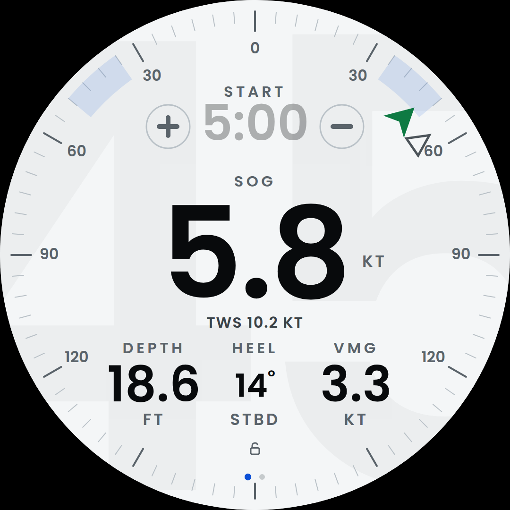
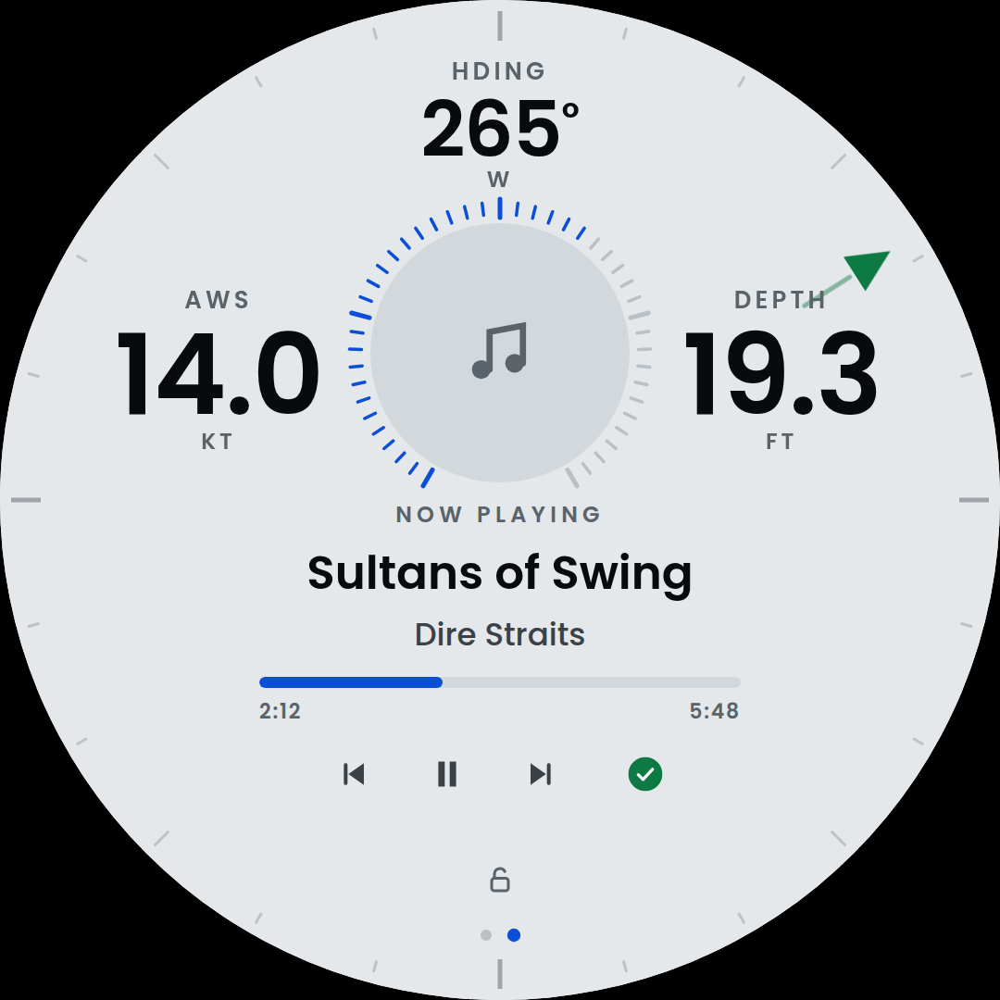
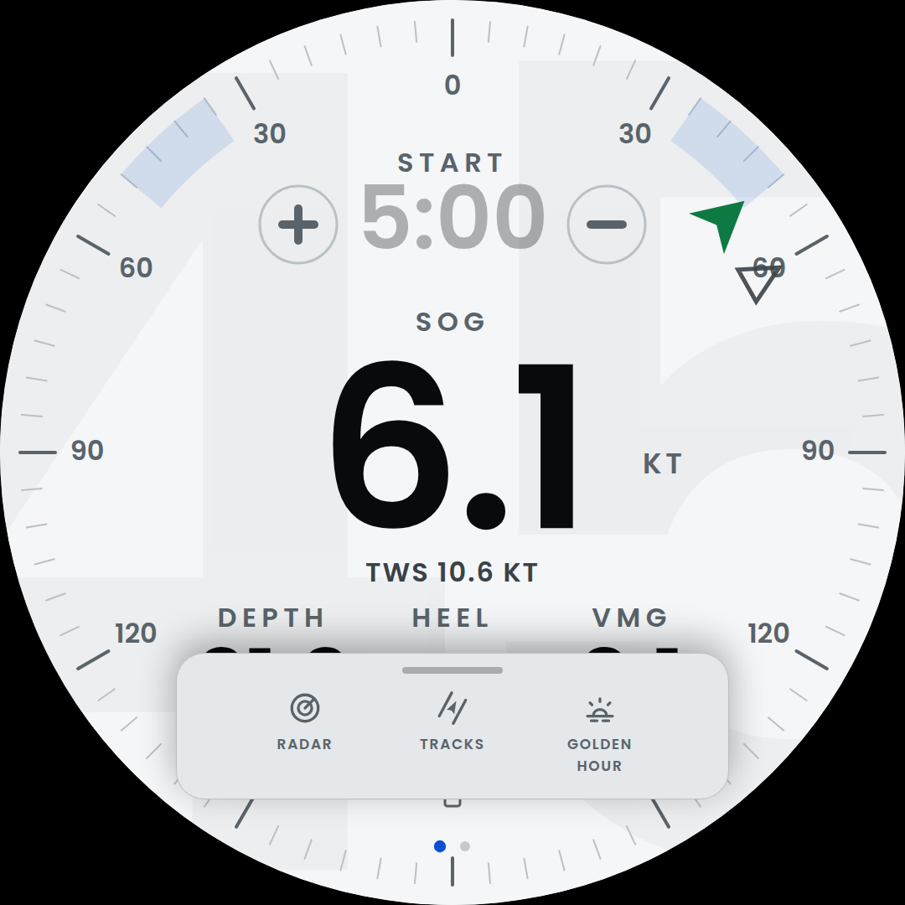
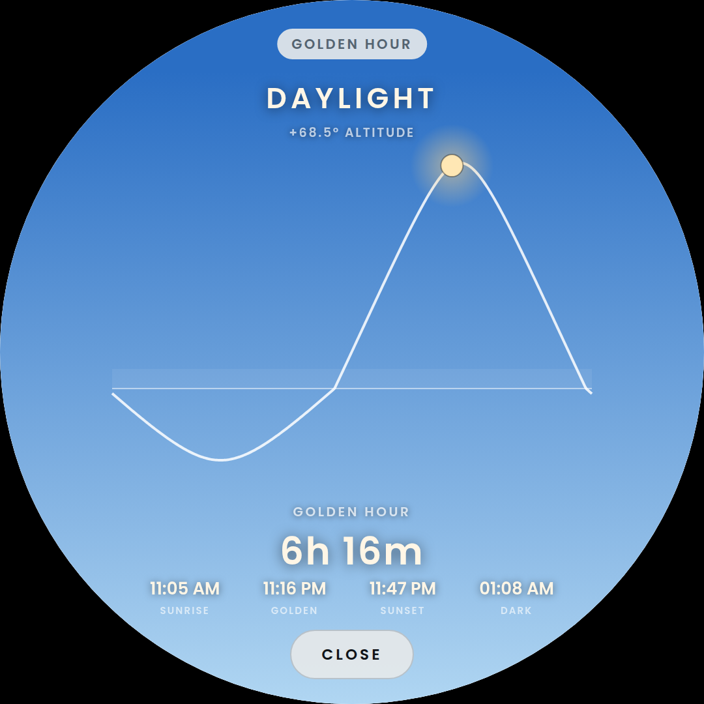
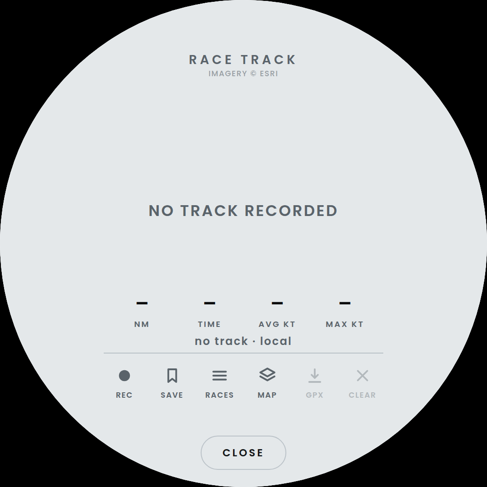
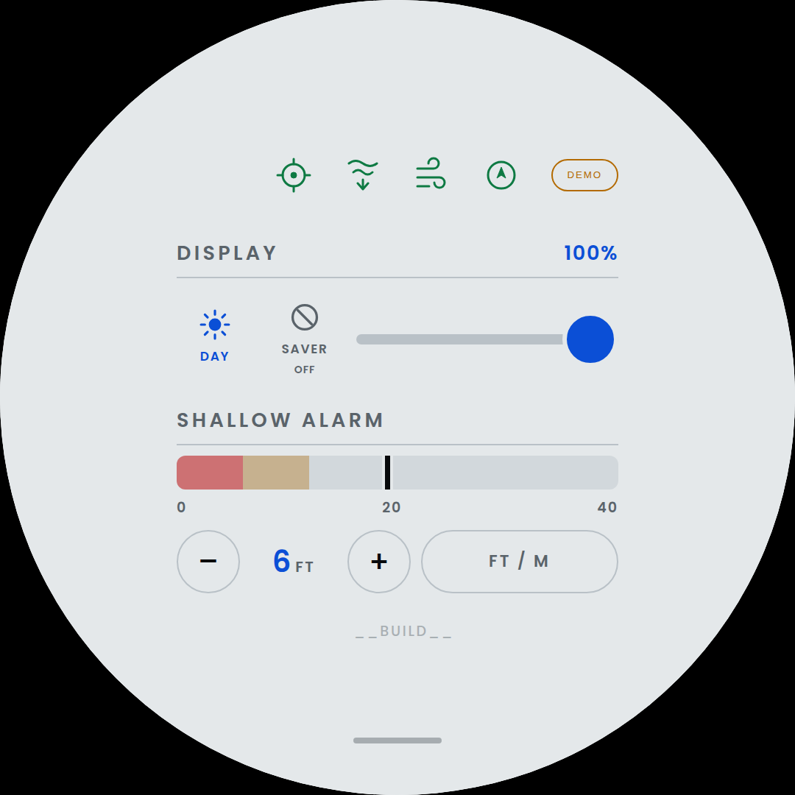
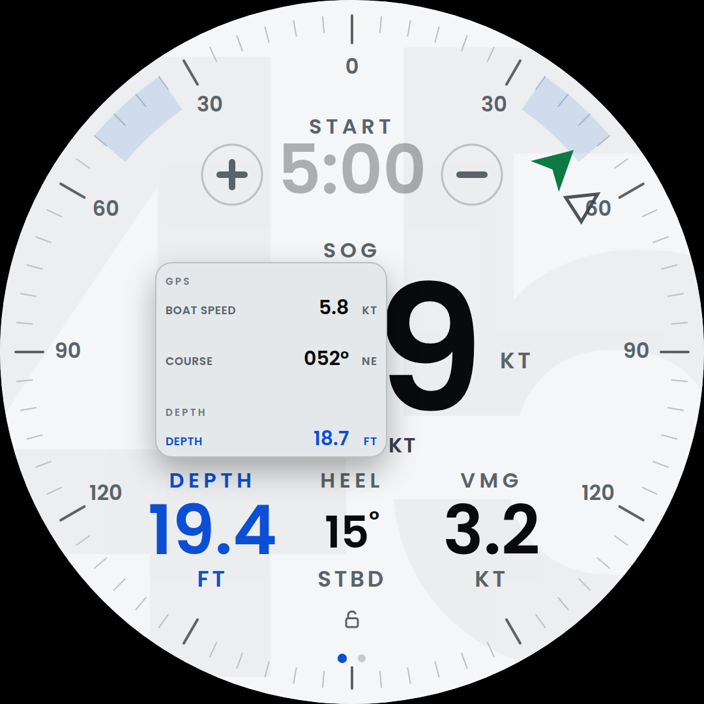

# Confluence Helm

Instrument display for the club racing boat *Confluence*. One
self-contained HTML file — no build step, no dependencies, no framework —
running in Chromium on a 1080×1080 round touch panel at the helm.



Speed, depth, wind and heel on a round face you can read in sunlight and
work with wet hands, plus a start-line timer, a rain radar, a track
recorder and the boat's music.

---

## Two pages, three apps

**Pages** sit side by side. Swipe left or right to move between them; two
dots at the foot say where you are. The dial is the one you come back to.

```
        DIAL   <->   music
       * .            . *
```

| | |
|---|---|
|  | **Dial** — the instrument. Five readings you choose, a compass bezel carrying apparent and true wind marks, and a start-line timer you tap to run. |
|  | **Music** — what is playing, transport, a volume ring around the album art, and three more readings around that. |

**Apps** are not pages, and the difference is deliberate: a page is always
loaded and always costing something, so anything you only sometimes want
lives in a dock instead, swiped up from the bottom and torn down on close.



| | |
|---|---|
|  | **Golden Hour** — sun altitude through the day, with sunrise, the golden window, sunset and dark. |
|  | **Tracks** — record a sail, keep it on the boat, replay it on satellite imagery, hand it to a phone by QR code. *(shown empty — nothing recorded)* |

**Radar** is the third app: rain from two services, a metered short-range
forecast, and an optional wind-particle layer, all inside a fixed memory
budget. It needs the network, so there is no screenshot of it here.

Pulled **down** from the top over any of it is the **control panel** —
WiFi, Bluetooth, brightness, power, the depth alarm, and the sensor row
that says which instruments are actually feeding.



## Reading the dial

Every number is a choice. **Tap any reading and a menu unrolls from it**,
grouped by instrument, listing all thirteen with their live values.



The defaults are boat speed in the middle, true wind under it, and depth,
heel and VMG along the bottom — but any of the thirteen goes in any slot,
on either page, and the choice is remembered.

→ **[What every reading means, and where it comes from](docs/readings.md)**

## The gestures

| | |
|---|---|
| swipe **left / right** | move between the two pages (three fingers, or one on a single-touch panel) |
| swipe **down** from the top | the control panel |
| swipe **up** from the bottom | the app dock |
| **tap** a reading | change what it shows |
| **tap** the timer | start or sync the countdown; double-tap to start racing |
| **hold** anywhere on the dial | reset |
| **hold** the padlock | lock the touchscreen for a wipe-down |

Swipes work from off the bezel, which is where a thumb actually starts on
a round panel. → [the whole gesture story](docs/display.md#how-many-fingers)

---

## Running it

The app is **served over HTTP by AvNav**, not opened from `file://`:

```
http://localhost:8080/user/helm/confluence_helm.html
```

That matters — Chromium cannot `fetch()` a `file://` URL, so the music
page silently never works from disk. Serving it also puts the display on
any phone or tablet on the boat WiFi.

There are two copies of the HTML, deliberately:

| Path | Role |
|---|---|
| `~/helm/` | the repo — **edit here** |
| `~/avnav/data/user/helm/` | what AvNav serves and the kiosk loads |

```bash
# edit ~/helm/confluence_helm.html, then
bash ~/helm/deploy.sh
```

`deploy.sh` is the only thing that should write the served copy.
`autopull.sh` does it for you when the repo changes, so a push from a
laptop reaches the helm on its own.

→ [Kiosk, boot and power](docs/kiosk.md) for the session, the autostart
entries, cage mode and the recovery paths.

## What is in the repo

```
confluence_helm.html      the whole app: markup, CSS, JS
start-kiosk.sh            what the desktop session launches at boot
deploy.sh                 publishes the app to where AvNav serves it
autopull.sh               pulls the repo and redeploys when it changes
netd.py                   local helper: WiFi and Bluetooth for the panel
netd.sh                   keeps netd.py running, and lets a push replace it
open-window.sh            opens the app in its own window (desktop shortcut)
autostart/                the .desktop files that start those two loops
desktop/                  the desktop shortcut itself
spotify-now.py            polls the Spotify Web API -> nowplaying.json
spotify-auth.py           one-time Spotify authorisation
confluence-helm.svg       desktop shortcut icon
tiles/                    satellite pack (gitignored, ~33 MB)
docs/                     everything below
```

## Documentation

| | |
|---|---|
| [Readings](docs/readings.md) | the thirteen numbers, what each means, and the picker |
| [The display](docs/display.md) | pages, gestures, the panel and dock, brightness, touch lock, alerts, golden hour |
| [Radar](docs/radar.md) | two rain services, the metered forecast, the wind layer, the memory budget |
| [Tracks](docs/tracks.md) | recording a sail, the library, and getting one onto a phone |
| [Music](docs/music.md) | Spotify without a Connect daemon — what polls, and what it will not do |
| [Network](docs/network.md) | WiFi, the hotspot, and `netd.py` |
| [Kiosk, boot and power](docs/kiosk.md) | the session, autostart, cage mode, recovery |
| [Internals](docs/internals.md) | render architecture, where data lives, charts, and the gotchas |

Those pages are written as a logbook rather than a manual: they say why
each thing is the way it is, and record the bugs that shaped it. That is
deliberate — most of what is expensive to rediscover about this app is
*why*, not *what*. Where one has fallen behind the code, it says so at
the top of the section rather than being quietly corrected.

## The premise

One file, no build step, no dependencies. It is not a limitation to work
around; it is the point. The helm display has to come up on a Pi in a
cockpit with no network, no toolchain and nobody to fix it, and a file
that Chromium can open is the shortest path between a repo and a working
instrument. Every decision in `docs/` is downstream of that.
