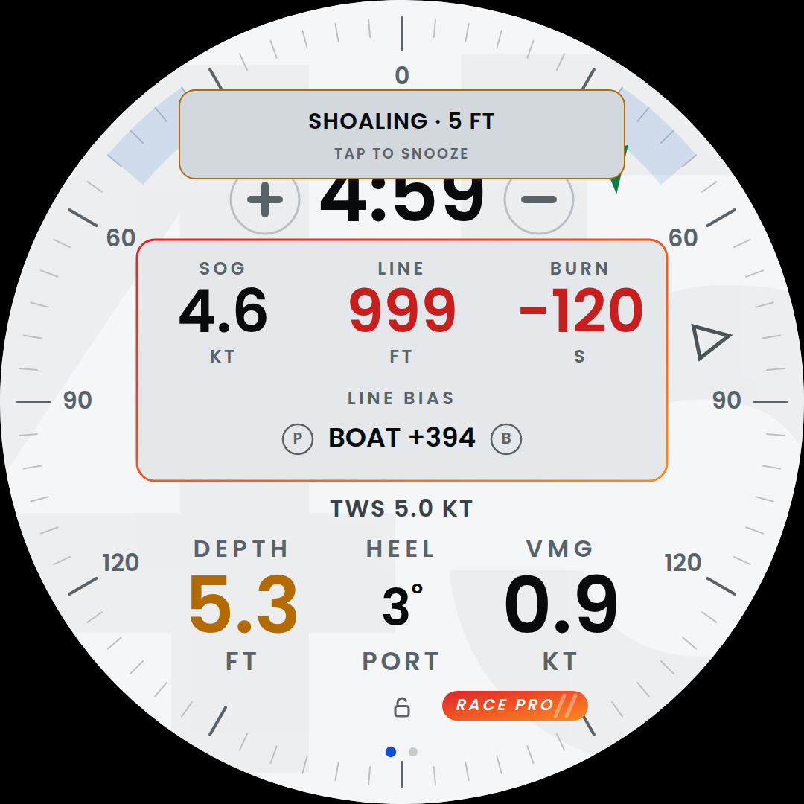
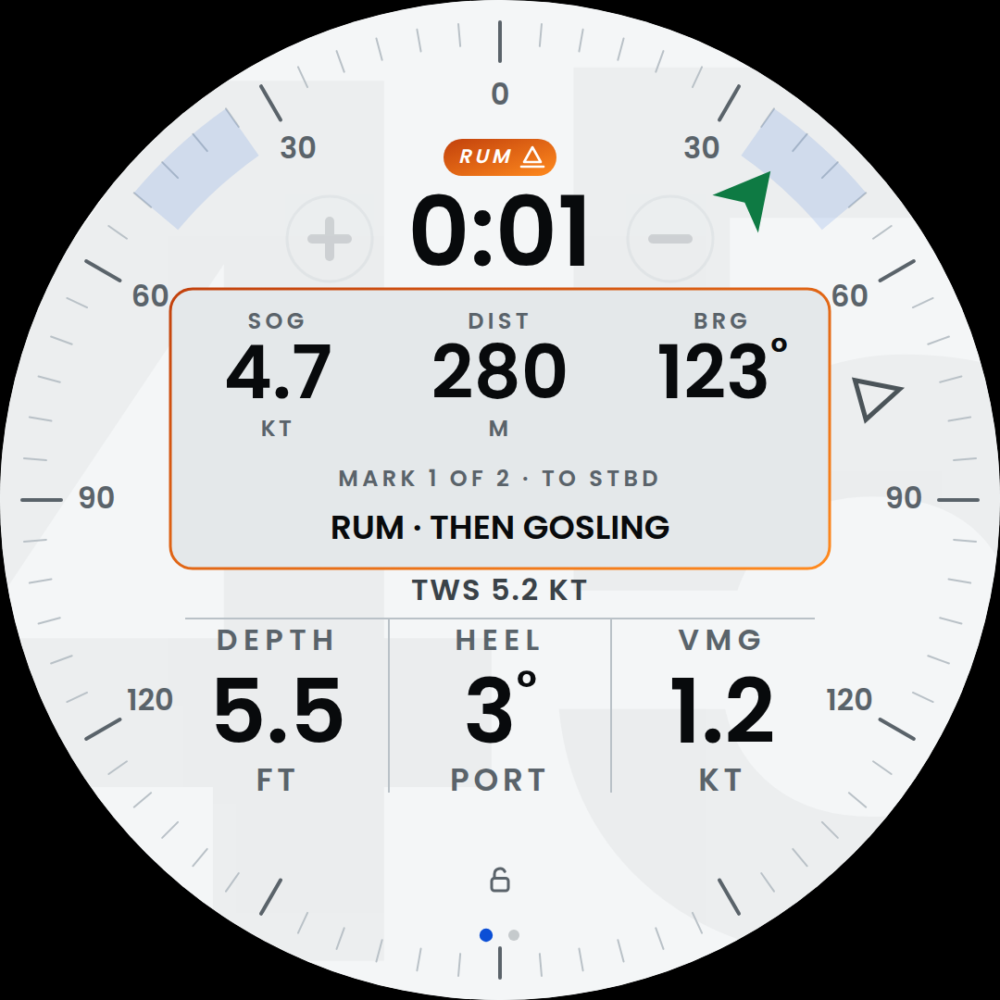
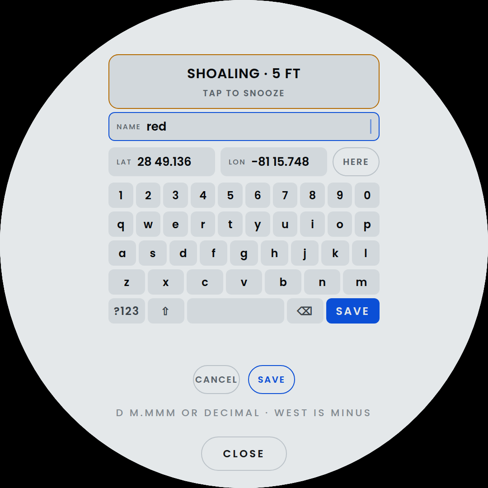
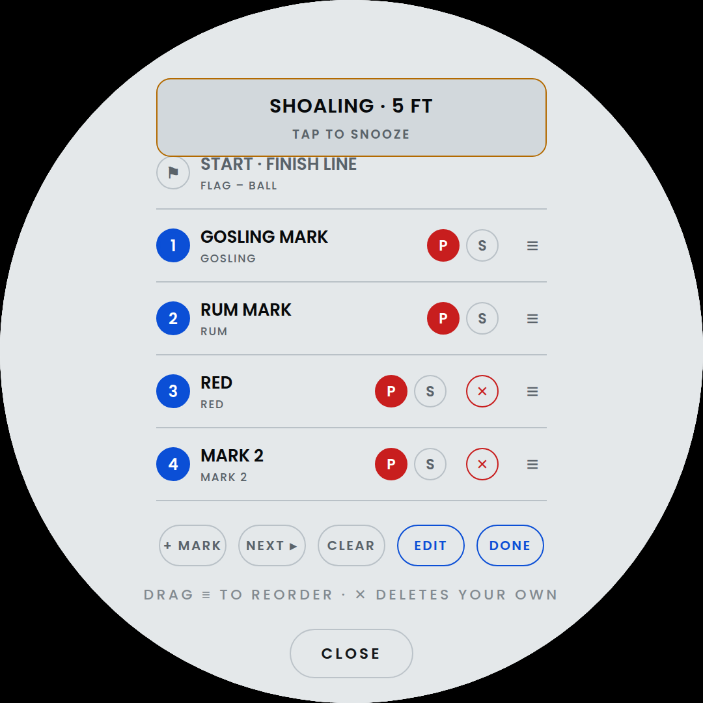

# Readings

What the numbers on the glass are, where each one comes from, and how to
put a different one in any slot.

[← back to the README](../README.md)

## Every slot is a choice

There are no fixed readouts. **Tap any number and a menu unrolls from
it**, listing every reading with its live value; tap one and
it takes that slot. The reading that was there moves to wherever the new
one came from — a swap, not a shuffle, so nothing you did not touch ever
moves.


The menu is grouped by **instrument**, which is the useful sort: it
answers "what else can this box tell me", and it makes a dead sensor
obvious. A whole group dashed out is a wire to check; one dashed row
among many reads as normal.

It opens on the reading the slot already holds, centred, rather than at
the top — the list is longer than fits, and starting at BOAT SPEED
every time means hunting for where you are before you can go anywhere.
Drag to scroll it; a flick coasts. A drag never chooses anything, however
it ends.

Choices are saved per page (`musSlots` and `dialSlots` in browser
storage) and survive a restart. The two pages keep separate maps — the
dial and the music page are not showing the same things and never were.

## The readings

Values are magnetic where a compass is involved, and metric or imperial
follows the depth-unit setting.

### GPS

| Reading | Header | Unit | Signal K path |
|---|---|---|---|
| BOAT SPEED | `SOG` | KT | `navigation.speedOverGround` |
| COURSE | `COG` | compass point | `navigation.courseOverGroundTrue` |

**COURSE** is where the boat is *going*, which is not where it is
pointing — the difference is tide and leeway, and on a windward leg it is
the whole story. True, not magnetic: that is what the GPS puts on the
wire, and relabelling it would be a lie.

### Depth

| Reading | Header | Unit | Signal K path |
|---|---|---|---|
| DEPTH | `DEPTH` | FT / M | `environment.depth.belowKeel`, falling back to `…belowTransducer` |

Below the keel when the sounder is configured with an offset, below the
transducer when it is not. This is the reading the shallow alarm watches.

### Wind

| Reading | Header | Unit | Signal K path |
|---|---|---|---|
| APPARENT WIND | `AWS` | KT | `environment.wind.speedApparent` |
| TRUE WIND SPEED | `TWS` | KT | `environment.wind.speedTrue` |
| WIND ANGLE | `AWA` | — | `environment.wind.angleApparent` |
| TRUE WIND ANGLE | `TWA` | STBD / PORT | `environment.wind.angleTrueWater` |
| WIND DIRECTION | `TWD` | compass point | `environment.wind.directionTrue` |
| WIND SHIFT | `SHIFT` | LIFT / HEADER / STEADY | the direction against its own five-minute mean |

**WIND DIRECTION** is the one wind number that does not move when the
boat turns, which is what makes a shift a shift rather than a helm error.

**WIND SHIFT** is that direction against a slow average of where it has
been: the number is how far, the line under it which way — LIFT or
HEADER by tack, STEADY under two degrees with the degrees still shown,
because a 1° is not a 0°. Green for a lift, red for a header. The
average keeps running whether or not the reading is on the glass, so
picking it mid-lift shows the lift rather than a mean that has just
been reset to now.

**WIND ANGLE** is signed either side of the bow, the way it is called on
deck: forty degrees to starboard is 40, not 320. **TRUE WIND ANGLE** is
unsigned with the side spelled out underneath, because 12 STBD reads the
way it is said where −12 has to be decoded.

### Motion — the 9-axis

| Reading | Header | Unit | Signal K path |
|---|---|---|---|
| HEADING | `HDING` | compass point | `navigation.headingMagnetic`, falling back to `…courseOverGroundTrue` |
| HEEL | `HEEL` | STBD / PORT | `navigation.attitude` → roll |
| PITCH | `PITCH` | BOW UP / BOW DN | `navigation.attitude` → pitch |
| RATE OF TURN | `ROT` | °/MIN | `navigation.rateOfTurn` |

**HEADING** carries its compass point on the unit line — the one thing
three figures do not tell you at a glance. 258 is a number you decode; W
is a direction you already know. Eight points rather than four, because
four are wrong most of the time: 258 is not west, it is west by a bit.

**PITCH** is fore-and-aft trim: crew weight upwind, and how hard she is
burying the bow off it.

**RATE OF TURN** is degrees per *minute*, not per second — a boat turns
at a rate you would otherwise be reading as 0.2. Signed, because a heel
and a swing both reading "12 STBD" would be two cells that look
identical, and the rate is the part you cannot guess.

### Performance

| Reading | Header | Unit | Source |
|---|---|---|---|
| VMG | `VMG` | KT | `performance.velocityMadeGood`, or SOG × cos(TWA) |
| TARGET SPEED | `TGT` | % | SOG against the polar target for this true wind |

Not sensors, and they do not pretend to be. The Signal K plugin serves
VMG when it can; the arithmetic is the same number when it cannot.

**TARGET SPEED** is how close the boat is to what the polar says she
should be doing at this wind speed and angle: green at 98 % and up, red
under 90 %. It used to live with the race set and was asked out — it is
wanted on a Sunday beat as much as on a leg, and no more a start-line
number than VMG is.

## Where they can go

**The dial** has five slots.


| Slot | Where | Default |
|---|---|---|
| `c0` | the big number in the middle, with its unit beside it | BOAT SPEED |
| `c4` | the strip under it — header, value and unit on one line | TRUE WIND SPEED |
| `c1` `c2` `c3` | the row along the bottom | DEPTH · HEEL · VMG |

The bottom three are one size. A rule under the big number and another
above the row make the strip a band between them, and two hairlines
down from the lower rule cut the row into its cells, so the lower half
reads as one table: the number, its strip, the three cells. The middle one used to be smaller and dimmer, because the three
are 214 px apart and only the outer two could spill towards the rim;
with the cuts there is nowhere to spill, so all three are sized to the
space between them and read the same.

**The music page** has three, arranged around the album art.


| Slot | Where | Default |
|---|---|---|
| `a` | above the art | HEADING |
| `p` `s` | port and starboard of it | APPARENT WIND · DEPTH |

## What a reading looks like

Every one is three lines — header, value, unit — on both pages:

```
   AWS          <- what it is
   13.4         <- the number
   KT           <- what the number is in
```

The third line is the unit, unless the reading has a side to report, in
which case it is that: `STBD`, `PORT`, `BOW UP`. Heading and course put
their compass point there. Degree signs are drawn at 0.52 em and lifted
back to the top of the digits, so the ring reads as a unit rather than as
a fourth figure.

The dial's big cell is the exception: its unit sits *beside* the number
rather than under it, measured off the number's own right edge so it
stays against the last digit.

## RACE

A pill above the countdown that says where in the race you are, and
opens into a box over the big number with the numbers that matter for
that part of it.

| The pill says | Colour | Icon | When |
|---|---|---|---|
| `RACE` | blue | slashes | idle |
| `COUNTDOWN` | amber | flag | the countdown |
| `RACING` | green | chevrons | after the gun |
| the mark's name, `RUM` | orange | buoy | racing, within 300 m of the next mark |
| `FINISH` | orange | chequered flag | racing, within 300 m of the finish line, once clear of it since the gun |
| `FINISHED` | slate | chequered flag | after the finish |

The box's border takes the pill's colour, so the two read as one thing.

**Opening and closing.** Tap the pill and the box opens or closes in
any state. The countdown opens it by itself and the gun closes it.
Closing on a mark opens it by itself and the rounding closes it — and
so does sailing back out beyond 350 m, so a range that wobbles about
the line does not flap it. A hand that closed it stays respected until
the next thing happens. Reset closes it.

**The box covers the big cell**, so its first slot carries whatever
that cell was showing — SOG, or depth, or whatever you put there — and
nothing is lost. The strip and the three readings along the bottom stay
in view under it. What fills the other slots depends on where you are:



*Before the gun*, the line:

| Item | What it is |
|---|---|
| `LINE` | distance to the line, metres or feet with the depth unit; red when you are over |
| `BURN` | seconds in hand to the line at this speed; red when you are late; dashes until the clock runs |
| `LINE BIAS` | the favoured end and what it is worth, `PIN +12`, between the two ends |
| `P` `B` | the two ends of the line; tap each as you pass it, and the bias is then about the line you pinged rather than the club marks |



*After the gun*, the leg:

| Item | What it is |
|---|---|
| `DIST` | range to the next mark, metres under 1000 and nautical miles beyond |
| `BRG` | true bearing to it, to steer against COG |
| `MARK 2 OF 5 · TO PORT` | which mark, which side to leave it, and what follows it: `RUM · THEN GOSLING`; on the last leg, `FINISH LINE` |

The next mark comes from the course set in the Tracks app: tap marks
on the course sheet in the order you will sail them. The course is
listed first, in its order, with the rest of the marks under it. Each
mark in the course gets a `P` and an `S` beside it for the side you
will leave it — port unless you say otherwise, red and green the way
the lights are. The side shows on the map by the mark's number and in
the box as you close on it. With no course set, the only leg is back
to the line.



**Marks of your own.** `+ MARK` on the sheet's bar opens a form: a name,
and a position typed on the app's own keyboard or taken from the GPS
with `HERE`. Positions read as the sailing instructions write them,
degrees and decimal minutes with a space between, or as decimal
degrees; west and south are minus. `SAVE` keeps the mark for good —
it is there after a reboot, on the sheet, on the map and in the
readings like the club's — and adds it to the course.



**EDIT** puts a grip on every course row: drag it onto another row and
the mark takes that place, and NEXT follows its mark rather than its
number. A mark of your own gets a ✕ in edit mode, which removes it from
the course and from storage. `DONE` leaves edit mode. Target speed and the wind
shift are not in the box: they are readings, picked into any slot like
the rest.

## When a sensor is not there

A reading with nothing behind it shows `––` on the glass and `—` in the
menu, dimmed. It stays selectable — the sensor may wake up — but it does
not look live. Which instruments are actually feeding is shown by the
four glyphs at the top of the control panel.
