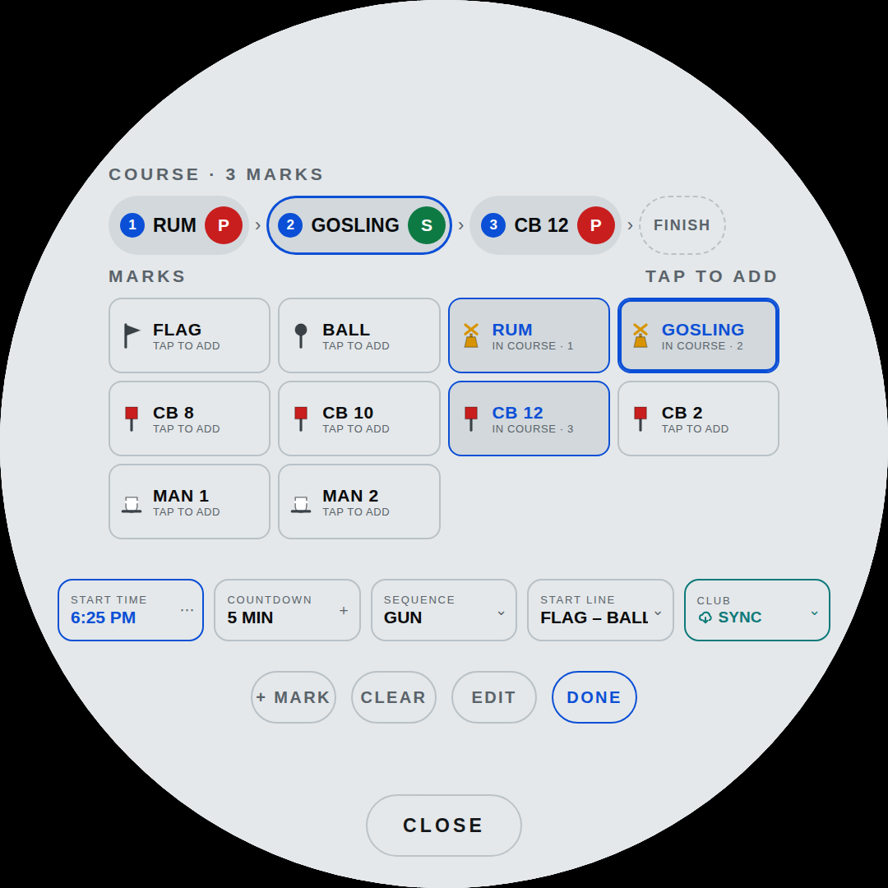
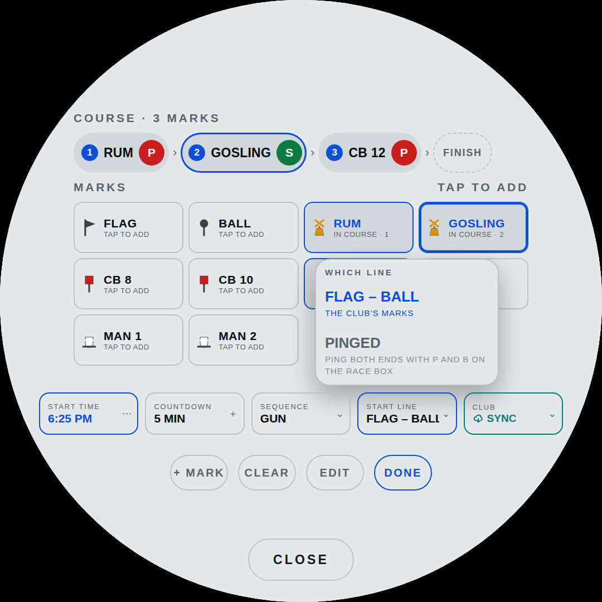
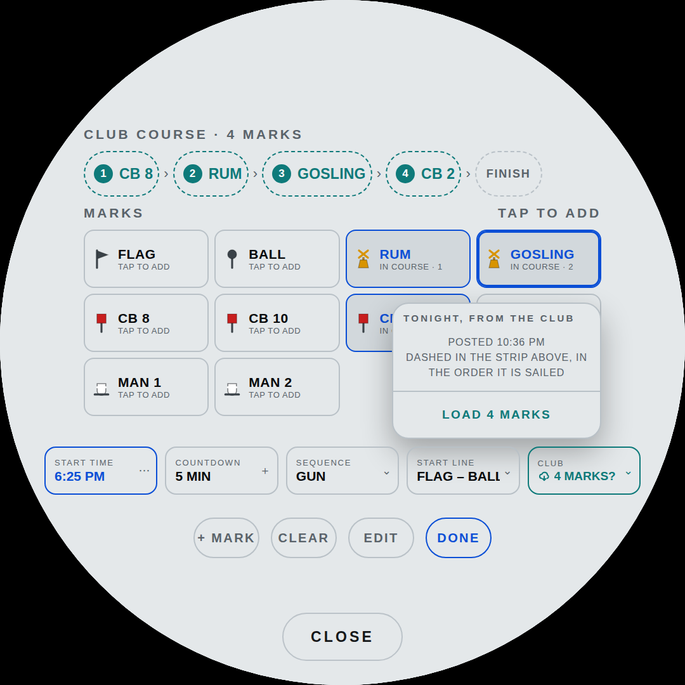

# Readings

What the numbers on the glass are, where each one comes from, and how to
put a different one in any slot.

[← back to the README](../README.md)

## Every slot is a choice

There are no fixed readouts. **Tap any number and a menu unrolls from
it**, listing every reading with its live value; tap one and
it takes that slot. The reading that was there moves to wherever the new
one came from — a swap, not a shuffle, so nothing you did not touch ever
moves.


The menu is grouped by **instrument**, which is the useful sort: it
answers "what else can this box tell me", and it makes a dead sensor
obvious. A whole group dashed out is a wire to check; one dashed row
among many reads as normal.

It opens on the reading the slot already holds, centred, rather than at
the top — the list is longer than fits, and starting at BOAT SPEED
every time means hunting for where you are before you can go anywhere.
Drag to scroll it; a flick coasts. A drag never chooses anything, however
it ends.

Choices are saved per page (`musSlots` and `dialSlots` in browser
storage) and survive a restart. The two pages keep separate maps — the
dial and the music page are not showing the same things and never were.

## The readings

Values are magnetic where a compass is involved, and metric or imperial
follows the depth-unit setting.

### GPS

| Reading | Header | Unit | Signal K path |
|---|---|---|---|
| BOAT SPEED | `SOG` | KT | `navigation.speedOverGround` |
| COURSE | `COG` | compass point | `navigation.courseOverGroundTrue` |

**COURSE** is where the boat is *going*, which is not where it is
pointing — the difference is tide and leeway, and on a windward leg it is
the whole story. True, not magnetic: that is what the GPS puts on the
wire, and relabelling it would be a lie.

### Depth

| Reading | Header | Unit | Signal K path |
|---|---|---|---|
| DEPTH | `DEPTH` | FT / M | `environment.depth.belowKeel`, falling back to `…belowTransducer` |

Below the keel when the sounder is configured with an offset, below the
transducer when it is not. This is the reading the shallow alarm watches.

### Wind

| Reading | Header | Unit | Signal K path |
|---|---|---|---|
| APPARENT WIND | `AWS` | KT | `environment.wind.speedApparent` |
| TRUE WIND SPEED | `TWS` | KT | `environment.wind.speedTrue` |
| WIND ANGLE | `AWA` | — | `environment.wind.angleApparent` |
| TRUE WIND ANGLE | `TWA` | STBD / PORT | `environment.wind.angleTrueWater` |
| WIND DIRECTION | `TWD` | compass point | `environment.wind.directionTrue` |
| WIND SHIFT | `SHIFT` | LIFT / HEADER / STEADY | the direction against its own five-minute mean |

**WIND DIRECTION** is the one wind number that does not move when the
boat turns, which is what makes a shift a shift rather than a helm error.

**WIND SHIFT** is that direction against a slow average of where it has
been: the number is how far, the line under it which way — LIFT or
HEADER by tack, STEADY under two degrees with the degrees still shown,
because a 1° is not a 0°. Green for a lift, red for a header. The
average keeps running whether or not the reading is on the glass, so
picking it mid-lift shows the lift rather than a mean that has just
been reset to now.

**WIND ANGLE** is signed either side of the bow, the way it is called on
deck: forty degrees to starboard is 40, not 320. **TRUE WIND ANGLE** is
unsigned with the side spelled out underneath, because 12 STBD reads the
way it is said where −12 has to be decoded.

### Motion — the 9-axis

| Reading | Header | Unit | Signal K path |
|---|---|---|---|
| HEADING | `HDING` | compass point | `navigation.headingMagnetic`, falling back to `…courseOverGroundTrue` |
| HEEL | `HEEL` | STBD / PORT | `navigation.attitude` → roll |
| PITCH | `PITCH` | BOW UP / BOW DN | `navigation.attitude` → pitch |
| RATE OF TURN | `ROT` | °/MIN | `navigation.rateOfTurn` |

**HEADING** carries its compass point on the unit line — the one thing
three figures do not tell you at a glance. 258 is a number you decode; W
is a direction you already know. Eight points rather than four, because
four are wrong most of the time: 258 is not west, it is west by a bit.

**PITCH** is fore-and-aft trim: crew weight upwind, and how hard she is
burying the bow off it.

**RATE OF TURN** is degrees per *minute*, not per second — a boat turns
at a rate you would otherwise be reading as 0.2. Signed, because a heel
and a swing both reading "12 STBD" would be two cells that look
identical, and the rate is the part you cannot guess.

### Performance

| Reading | Header | Unit | Source |
|---|---|---|---|
| VMG | `VMG` | KT | `performance.velocityMadeGood`, or SOG × cos(TWA) |
| TARGET SPEED | `TGT` | % | SOG against the polar target for this true wind |

Not sensors, and they do not pretend to be. The Signal K plugin serves
VMG when it can; the arithmetic is the same number when it cannot.

**TARGET SPEED** is how close the boat is to what the polar says she
should be doing at this wind speed and angle: green at 98 % and up, red
under 90 %. It used to live with the race set and was asked out — it is
wanted on a Sunday beat as much as on a leg, and no more a start-line
number than VMG is.

## Where they can go

**The dial** has five slots.


| Slot | Where | Default |
|---|---|---|
| `c0` | the big number in the middle, with its unit beside it | BOAT SPEED |
| `c4` | the strip under it — header, value and unit on one line | TRUE WIND SPEED |
| `c1` `c2` `c3` | the row along the bottom | DEPTH · HEEL · VMG |

The bottom three are one size. A rule under the big number and another
above the row make the strip a band between them, and two hairlines
down from the lower rule cut the row into its cells, so the lower half
reads as one table: the number, its strip, the three cells. The middle one used to be smaller and dimmer, because the three
are 214 px apart and only the outer two could spill towards the rim;
with the cuts there is nowhere to spill, so all three are sized to the
space between them and read the same.

**The music page** has three, arranged around the album art.


| Slot | Where | Default |
|---|---|---|
| `a` | above the art | HEADING |
| `p` `s` | port and starboard of it | APPARENT WIND · DEPTH |

## What a reading looks like

Every one is three lines — header, value, unit — on both pages:

```
   AWS          <- what it is
   13.4         <- the number
   KT           <- what the number is in
```

The third line is the unit, unless the reading has a side to report, in
which case it is that: `STBD`, `PORT`, `BOW UP`. Heading and course put
their compass point there. Degree signs are drawn at 0.52 em and lifted
back to the top of the digits, so the ring reads as a unit rather than as
a fourth figure.

The dial's big cell is the exception: its unit sits *beside* the number
rather than under it, measured off the number's own right edge so it
stays against the last digit.

## RACE

A pill above the countdown that says where in the race you are, and
opens into a box over the big number with the numbers that matter for
that part of it.

| The pill says | Colour | Icon | When |
|---|---|---|---|
| `RACE` | blue | slashes | idle |
| `COUNTDOWN` | amber | flag | the countdown |
| `RACING` | green | chevrons | after the gun |
| the mark's name, `RUM` | orange | buoy | racing, within 300 m of the next mark |
| `FINISH` | orange | chequered flag | racing, within 300 m of the finish line, once clear of it since the gun |
| `FINISHED` | slate | chequered flag | after the finish |

The box's border takes the pill's colour, so the two read as one thing.

**Opening and closing.** Tap the pill and the box opens or closes in
any state. The countdown opens it by itself and the gun closes it.
Closing on a mark opens it by itself and the rounding closes it — and
so does sailing back out beyond 350 m, so a range that wobbles about
the line does not flap it. A hand that closed it stays respected until
the next thing happens. Reset closes it.

The countdown also sounds. The face flashes and the sounder goes, on
the pattern a race committee sounds — out of the Pi's 3.5 mm jack into
an amp and a speaker, or off a GPIO pin into a piezo.
→ [Countdown signals](display.md#countdown-signals)

**The box covers the big cell**, so its first slot carries whatever
that cell was showing — SOG, or depth, or whatever you put there — and
nothing is lost. The strip and the three readings along the bottom stay
in view under it. What fills the other slots depends on where you are:


*Before the gun*, the line:

| Item | What it is |
|---|---|
| `LINE` | distance to the line, metres or feet with the depth unit; red when you are over |
| `BURN` | seconds to burn off before the gun at this speed on this course: `+` is slack, `−` is red and means you cannot make the line in time. Dashes until the clock runs, and whenever you are not closing on the line — sailing away from it or drifting, there is no time-to-line to count against |
| `LINE BIAS` | the favoured end and what it is worth, `PIN +12`, between the two ends |
| `P` `B` | the two ends of the line; tap each as you pass it, and the bias is then about the line you pinged rather than the club marks |


*After the gun*, the leg:

| Item | What it is |
|---|---|
| `DIST` | range to the next mark, metres under 1000 and nautical miles beyond |
| `BRG` | true bearing to it, to steer against COG; double-tap it to move the course on by hand, for a mark rounded wide or one the committee dropped |
| `MARK 2 OF 5 · TO PORT` | which mark, which side to leave it, and what follows it: `RUM · THEN GOSLING`; on the last leg, `FINISH LINE` |

**The line starts and finishes the race on its own.** Crossing it is
watched on every fix, and the instant is interpolated between the two
fixes either side of it rather than rounded to the one that noticed.
Both fixes have to fall between the ends, so a boat rounding outside
the pin is not a crossing, and a jump of more than 80 m between them is
discarded as a bad fix rather than believed.

*The gun can be scheduled.* `START TIME` is the first of the five
settings under the marks on the course sheet: type the time off the
sailing instructions — three or four digits and `AM`/`PM`, so `6` `2`
`5` `PM` — and the countdown starts itself `COUNTDOWN` before it and
runs out exactly on it. The readout then says when the gun is and lights
to show it is armed, the one beside it says how long the countdown runs,
and the RACE pill carries the time, so you can see it without opening
anything.

- Set it **inside** the window — three minutes before a five minute
  sequence — and the countdown starts at once, still ending on the gun.
- It is **one shot**: it clears when it fires, so it cannot fire again
  into the race it just started. Starting a countdown by hand disarms
  it for the same reason.
- A time that has **already passed** is refused rather than rolled to
  tomorrow. `18:25` typed at `18:30` is a typo far more often than it is
  a plan for tomorrow evening, and arming for tomorrow would look
  exactly like working while doing nothing tonight.
- It survives a restart, because the kiosk restarts on every deploy —
  but it is dropped on load once it is more than a countdown old, so
  yesterday's race does not arm itself tonight.
- A gun that went while the panel was off starts nothing.
- `12` is the one the clock face gets backwards: `12:25 PM` is twenty
  five past noon and `12:25 AM` is twenty five past midnight, and
  neither is twelve hours on from the other eleven.

The pad's keys are **112 px**, which is 45 on a 430 px phone — the
smallest thing worth asking a thumb to hit is 44, and the 56 px it
borrowed from the mark keyboard was 22. There is **one** `SET`, on the
pad where the last digit leaves your thumb; it was on the pad *and* on
the bar, which is the same action twice. And the bar's other button says
`NO START TIME` rather than `CLEAR`: backspace clears a *digit* and that
clears the whole scheduled gun, and two very different consequences were
wearing the same word.

*Which kind of start* it is comes from the **SEQUENCE** readout under
the marks on the course sheet — `GUN` or `WINDOW`. Nothing on the water
tells them apart: the same crossing, at the same place, at the same
moment, is a start on one night and a foul on the other.

| | during the countdown | at zero | after |
|---|---|---|---|
| `GUN` | the line is **shut**. A crossing is being over early, and starts nothing | the gun goes, the race starts | **the gun stands.** Crossing twenty seconds late is twenty seconds of lost time |
| `WINDOW` | the line is **live**. Crossing is your gun, and the clock runs from that instant | if you never crossed, it starts anyway | the latest crossing within three minutes moves the start to it |

`GUN` is a proper sequence — Saturday. `WINDOW` is an open five minutes
you go when you are ready — Wednesday. Its menu shows both with what
each does to the line, opened on the one in force. It is remembered
across a restart, because it is a fact about the series and not about
today.

It lived on the control panel until the start time arrived. Everything
about a start is one thing, and the panel is where the boat is set up
rather than where a race is.

The difference *after* the gun is the one that reaches the scoreboard.
On a gun start the fleet's time runs from the gun whoever was where, so
a late crossing is lost time — the cost of a bad start, and not
something an instrument gets to refund. On a window start your own
crossing is your start, so the clock follows it.

Either way, crossing **onto the course side** is what counts. Turning
back across the line never starts the race — that crossing changes the
sign exactly as a start does, and taking it would start your race as
you retreat from the line. The crossing after it starts you, which is
what a boat that was over early wants.

*The finish* needs two more things to be true:

- **You have been clear of the line since the gun** — more than 60 m
  from it at some point. Without this the gun itself would finish the
  race.
- **The course is sailed.** Every mark rounded, or no course set at all.
  Plenty of club courses bring you back through the line on a leg, and a
  windward-leeward with the line mid-course does it every lap; before
  this the race ended on lap one, armed and crossing exactly as a finish
  looks. With no course set there is nothing to wait for and nothing
  changes.

Either way a double tap on the clock does it by hand, and nothing
automatic happens at all until you have started the countdown yourself.
The finish needs a true wind direction to know which side of the line is
which — from the wind instrument, or from `COG` and `TWA` — so a rig
with no wind data finishes by hand.

**The track between races.** Recording runs from the countdown to the
finish, so the approach to the line is in it too. The finish writes the
track to browser storage, which is the buffer that survives a reload —
it is **not** a saved race. Putting one in `RACES`, with its distance,
elapsed, average and maximum, is the save button on the track map, and
it stays deliberate.

A new countdown has to start on an empty track, or the next race saved
covers two and its numbers are nonsense. So the old one is set aside
rather than cleared: the new track starts clean, and a card comes up on
the face saying `LAST RACE NOT SAVED` with what it is holding —
`6.46 NM · 59:59 · 02:09` — and two answers, `SAVE TO RACES` and
`DISCARD`. Discard is armed and asks `SURE?` on the first tap, because a
mis-tap there throws away a race.

The card goes up *after* the countdown is already running, so answering
it is never on the critical path of a start, and it waits as long as it
takes: the held race is on disk, and a reload puts the card back rather
than losing it. A start that was aborted before the gun is cleared
without a question — there is no race in it to ask about — and so is one
already sitting in `RACES`.

**The score, at the finish.** Sailing the race is half the job; the
other half is typing the result into the club's scorer at
[vuduwave.com/lmsa](https://vuduwave.com/lmsa). Two things have to go
in, and the helm knows exactly one of them.

So it asks the other. A card comes up at the finish with a single
question — `SPINNAKER?` — because the boat has two entries in the
roster, the same hull under two handicaps, and the answer decides which
one the result belongs to:

| Answer | Class | Racer |
|---|---|---|
| no | `CAP22NS` | 200 |
| yes | `CAP22` | 201 |

The card shows the name and the class — `STEVEN ARTAU · G4 · CAP22NS`.
The racer id is what the API wants and nothing you would recognise at a
glance, so it stays out of sight.

Then it asks the second question — `SUBMIT TO VUDU WAVE?` — with the
entry and the elapsed time on the card, so what you are agreeing to is
in front of you. Two answers:

- **YES** posts it and shows what the server said back. The reply is
  the server's own words rather than ours: it is the only thing that
  knows whether the result went in.
- **NO** shows what to type instead — the time, the entry, and a QR
  code that opens the page on your phone.

A refusal or a dead connection lands on the same face as NO, with the
reason on it. The number still has to get in either way, and a card
that claimed success on a request that failed would be worse than no
card at all.

The time is written the way the form wants it. It takes `hh.mm.ss`,
`h.mm.ss`, `mm.ss`, `m.ss` or `DNF`/`DNS`/`DSQ`, with a dot, colon or
comma between; the card always writes the long one, so `0.48.15` rather
than `48.15` — both are valid and there is no boundary to get wrong.

It asks both questions every time rather than remembering, and a new
finish asks again rather than assuming.

### How the submission goes

**Straight from the page.** `vuduwave.com` answers a CORS preflight by
reflecting whatever `Origin` asked, so a `POST` from here is allowed
wherever this file is served from — the panel, a phone, GitHub Pages:

```
POST https://vuduwave.com/api/add_scratch_time
{"racer_id": 201, "elapsed_time": "1.04.15"}
```

That is the endpoint the page's own *Add Result* button posts to.

It used to go through `netd`, on the assumption that the browser would
be blocked. That assumption was wrong, and it cost the phone the whole
feature: the helper only exists on the Pi, and the phone is exactly
where you are standing when the race ends. **`netd` is the backstop
now, not the road** — if the direct post is blocked or the connection
dies, and the helper is there, the card tries `POST /score` before
giving up. On a phone there is no helper and no second chance, and the
card says so rather than pretending.

A device that already knows it has no network is not offered the
choice at all: the card goes straight to what to type, marked
`OFFLINE`.

`HELM_SCORE_URL` repoints the helper's copy; empty switches its half
off.

**The same result cannot go twice.** The last one that actually landed
is remembered for five minutes, so a second tap on an identical result
is refused with `ALREADY SENT` — but a retry after a *failure* goes
through, because nothing went in to repeat. A corrected time always
goes: the form itself says an incorrect time can be resubmitted. The
helper keeps its own ten-second floor between any two submissions, for
when it is the one doing the posting.

**No CAPTCHA token is sent.** The entry form runs an invisible
reCAPTCHA — you would never see it, which is the point of an invisible
one — and `netd` has no way to produce a token and no business faking
one. So the request goes without, and whatever the server answers comes
back for the card to show. If it is refused, it is refused, and the
fallback is the number on the glass and a phone.

**Rounding** advances the course on its own, and it does not trust the
mark's position to the metre. It watches for the two things that mean
you went round something: you got as close as you were going to get,
and then you went *past* it — the distance opened by 50 m and the
compass bearing to the mark swung by 40 degrees or more.

Both halves are load-bearing. Opening alone is also what a tack away
from a layline looks like, and on a beat that happens twice a leg; the
bearing barely moves on a tack, because the mark stays in the same
direction whatever the boat is pointing at.

Reading it off the bearing rather than off `COG` is deliberate. Only
position is involved, so nothing here needs a second sensor to be
right, and a rig that never publishes course over the ground rounds
marks exactly as well as one that does.

It replaced an absolute test — inside 40 m of the recorded position,
then back outside 60 — which is a bet that loses. Club coordinates come
to a tenth of a minute, which is 185 m of latitude and so up to 90 m of
error before anyone mistypes anything; a buoy swings a scope of its rode
around its anchor all day; and rounding wide is normal racing. Miss the
40 m and the mark never advanced at all, which is what happened on the
water.

A mark more than 200 m from where the boat actually sails never arms.
That is not a tolerance to widen: it means the position is wrong, and
the fix is to stand at the buoy and correct the mark with `HERE` —
see below, it works on the club's marks too. Meanwhile `BRG` in the
RACE box advances the course on a double tap.



The next mark comes from the course set in the Tracks app. **The course
reads across the top as a strip**, in the order you will sail it —
`1 RUM › 2 GOSLING › 3 CB 12 › FINISH` — and every mark this boat knows
sits under it as a tile. Tap a tile to put that mark on the end of the
course, and tap it again to take it out; the rest close up. The mark
being sailed to is the chip with the ring round it. With no course set,
the only leg is back to the line.

It was a list of rows, one to a mark, with the course's order given as
numbers down the left margin. Every mark was legible and the one thing
the sheet exists for — what the course *is*, in order — was the one
thing you had to assemble in your head.

**A tap on a chip flips which side that mark is left on**, `P` or `S` —
port unless you say otherwise, red and green the way the lights are.
The side shows on the map by the mark's number and in the box as you
close on it. Two buttons on every chip would have made the strip half
again as long, and it is a choice between exactly two things.

**Each tile is the buoy, its short name, and where it stands in the
course** — and the buoy is drawn as it looks on the water, because that
is how it is found:

| | |
|---|---|
| **yellow special, X topmark** | `RUM`, `GOSLING` — the club's own inflatables. Marks of the *course*, which is what the X says |
| **red board on a piling** | `CB 2`, `CB 8`, `CB 10`, `CB 12`. The channel here is not buoyed, it is **beaconed**: a stick out of the water with a square board on top |
| **green board on a tripod** | the green ones, which are three wooden sticks leaned together in a teepee with the board across the top. Two pilings apart at a glance, which is the whole reason for drawing them |
| **white can** | `MAN 1`, `MAN 2` — the manatee zone's regulatory marks, floating, on a waterline |
| **flag** and **ball** | `FLAG` and `BALL`: the Romance flag and its sail ball, which are the two ends of the line |
| **a plain pillar in the accent** | a mark of your own that has not said what it is |

**A mark of your own can say which buoy it is.** The form carries all
seven, under the position: tap one and it is kept with the mark, in
browser storage with everything else about it, and the sheet draws it.
That is how the green tripod gets drawn — it is a mark of yours, not one
of the club's ten. Correcting one of the club's marks can change its
buoy too, on the same terms as its name: stored only if you changed it,
so the correction stays a correction and the table still says what the
table says.

On the **night** theme every one of them is the same red, as everything
there is; the shapes still tell them apart, which is what tells them
apart out on the water in the dark anyway.

The drawing says in a glance what a line of type was spelling out, so
the tiles are smaller than they were — four across, and the ten club
marks fit without scrolling. Tiles carry the short name, the one the
cell headers and the RACE box use, where a name has to fit in 32 px.

In **EDIT** the tile says the mark's position instead of its place in
the course, as a chart writes it — `28 49.284N · 081 16.508W` — and the
grid goes to three across to fit it. The hemisphere is a letter and the
degrees are padded, because nothing read at arm's length should turn on
spotting a minus sign at 13 px.

### The five settings

**Everything about the evening that is not the course itself is one row
under the marks**, drawn the way the dial's readings are — a small label
over a value — because that is what they are: things you read at a
glance and only occasionally change.

| | reads | a tap |
|---|---|---|
| `START TIME` | `6:25 PM`, or `NOT SET` | opens the pad that types it |
| `COUNTDOWN` | `5 MIN` | **steps** it: 5, 10, 15, and round again |
| `SEQUENCE` | `GUN` or `WINDOW` | opens a menu: both, with what each does to the line |
| `START LINE` | `FLAG – BALL`, or `PINGED` | opens a menu: the two lines there are |
| `CLUB` | `SYNC`, `CHECKING…`, `4 MARKS?` | asks the club site and opens on the answer — see below |

The two clock facts are next to each other because between them they say
when the countdown starts, which neither says alone. The row is 940 wide
where the strip and the marks above it are 816: it sits low enough on
the glass that the circle allows it, and five readings want the room.

The countdown is the only one that opens nothing. Three values is not
worth opening, scrolling and dismissing something for. It is how long
the countdown runs — the club's sequence is five minutes, and a regatta
that runs ten or fifteen needs saying once. Change it while nothing is
running and the RACE pill carries the new length at once rather than at
the next reset.

**The menu** is the dial's readings picker in every respect that
matters: painted in `--panel` over a hairline so it reads as something
in front rather than a hole, **swiped to scroll** because nothing under
`#stage` scrolls itself, and **tapped to choose**. It opens *above* its
readout — the row is a hundred px off the bottom of the glass — on the
value already in force, so the choice you have is under your finger.
With one open, a tap on another of the five moves it; a tap anywhere
else puts it away.

**`START LINE` is which line the race starts *and* finishes on**, and it
is the one fact on this sheet you cannot work out from anything else on
it — so it names both ends rather than saying that a line exists. There
are exactly two, and its menu is those two:

| | |
|---|---|
| `FLAG – BALL` | the club's marks. They do not move — that is the line at LMSA |
| `PINGED` | the line you pinged with `P` and `B` on the race box, tapping each as you pass it |

A pinged line wins while it is there, for a day the committee lays it
somewhere else. Choosing `FLAG – BALL` **drops the pings** and goes back
to the marks — the way back from a ping taken at the wrong end. Until
both ends are pinged, `PINGED` is shown greyed rather than left out,
with `PING BOTH ENDS WITH P AND B ON THE RACE BOX` under it: a menu that
hid the other line would not say how to get it.



### CLUB SYNC



The club posts the evening's marks on the members' site by 5:30, the
same ones that go on the clubhouse door. The **`CLUB`** readout fetches
them: they are these marks under three different names, so the site does
the translating and hands back ids this file already knows.

**Two taps, never one.** The first asks, and shows what came back — the
club's course drawn in the strip in dashed outline, in the place it
would take, the readout reading `4 MARKS?`, and its menu open on when it
was posted and anything the committee wrote on it. The second tap is
`LOAD 4 MARKS` at the foot of that menu, and it is the only thing that
replaces your course. Tapping a control and having the course you are
three marks into vanish is not something this sheet should be able to do
by accident.

What did not come across is said before you load rather than found out
at the mark: `1 MARK THIS BOAT HAS NOT GOT`, and `IT DOES NOT START ON
THE LINE` for a course this sheet cannot draw a start for; both are
repeated over the settings row once it is loaded. A site that does not
answer says `NO ANSWER · IS THERE WIFI?`, changes nothing, and offers
`ASK THE CLUB` to try again.

It has to be *us* that asks. The helper binds loopback, so nothing off
the Pi can reach in and set a course — the right way round for a box on
a boat. The read at the other end is open, because a posted course is
public by the time it matters, so there is no login to carry.

It keeps its own colour among the four — `--club`, a teal, with a cloud
the course comes down out of. It is not one of the app's blue actions:
it is the only one of the four that reaches off the boat, and the only
tap on this sheet that can replace a course you are already sailing.


**Marks of your own.** `+ MARK` on the sheet's bar opens a form: a name,
a position typed on the app's own keyboard or taken from the GPS with
`HERE`, and which of the seven buoys it is. Positions read as the sailing instructions write them,
degrees and decimal minutes with a space between, or as decimal
degrees, with the hemisphere as a letter at either end or as a minus
for west and south — `28 49.03 N` and `081 16.17 W` go in as the chart
writes them. A position more than 100 NM from the
boat is refused with a hint about the minus: a longitude typed without
it lands in Asia, and the map would try to fit the globe. `SAVE` keeps
the mark for good —
it is there after a reboot, on the sheet, on the map and in the
readings like the club's — and adds it to the course.


**EDIT** is for the list itself, not the course — the course's order is
the strip, set by tapping. It puts a band down the right of every tile:
drag it onto another tile and the mark takes that place in the grid, the
club's marks included, and the order is kept. A mark of your own gets a
✕ in edit mode, which removes it from the course and from storage.

**Tapping a mark in edit mode opens it**, with its name and position
already in the fields. Outside edit mode a tap still adds and removes
marks from the course, which is what that tap is for the rest of the
time. `DONE` leaves edit mode.

What `SAVE` then does depends on whose mark it is.

### Correcting the club's marks

The coordinates in the file come from the sailing instructions, and the
sailing instructions are not a survey. They are given to a tenth of a
minute — 185 m of latitude before anyone mistypes anything — a buoy
swings its rode around its anchor all day, and one gets dragged and
reset a boat length from where it was without anybody writing it down.

So **a club mark can be corrected from the boat, standing at it, with
`HERE`** — the only instrument aboard that actually knows where the
thing is. Tap `EDIT`, tap the mark, tap `HERE`, tap `SAVE`.

| | |
|---|---|
| A mark of your own | edited in place — it *is* its position, there is nothing underneath |
| A club mark | **overridden** — the compiled coordinate stays, the correction sits over it |

A corrected mark writes its position in the accent colour on the sheet,
so you can see at a glance you are no longer looking at what the book
printed, and its row carries a **↺** where a mark of your own carries a
bin. That puts the sailing instructions' number back.

The override is stored by mark id, so it survives a reload and follows
into the course, the map, the readings and the rounding. The compiled
value is never touched — which matters the day the club re-lays a mark
and republishes: the file updates, and you find out whether your
correction still agrees with theirs.

Only the position is stored unless you change the name too, so a
correction stays a correction rather than quietly freezing the club's
name for that mark as well. An override for a mark the file no longer
has is kept rather than discarded — the club may bring it back. Target speed and the wind
shift are not in the box: they are readings, picked into any slot like
the rest.

## When a sensor is not there

A reading with nothing behind it shows `––` on the glass and `—` in the
menu, dimmed. It stays selectable — the sensor may wake up — but it does
not look live. Which instruments are actually feeding is shown by the
four glyphs at the top of the control panel.
